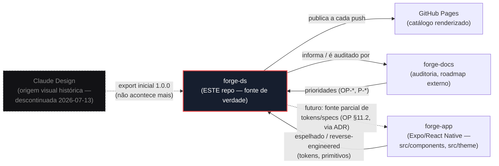
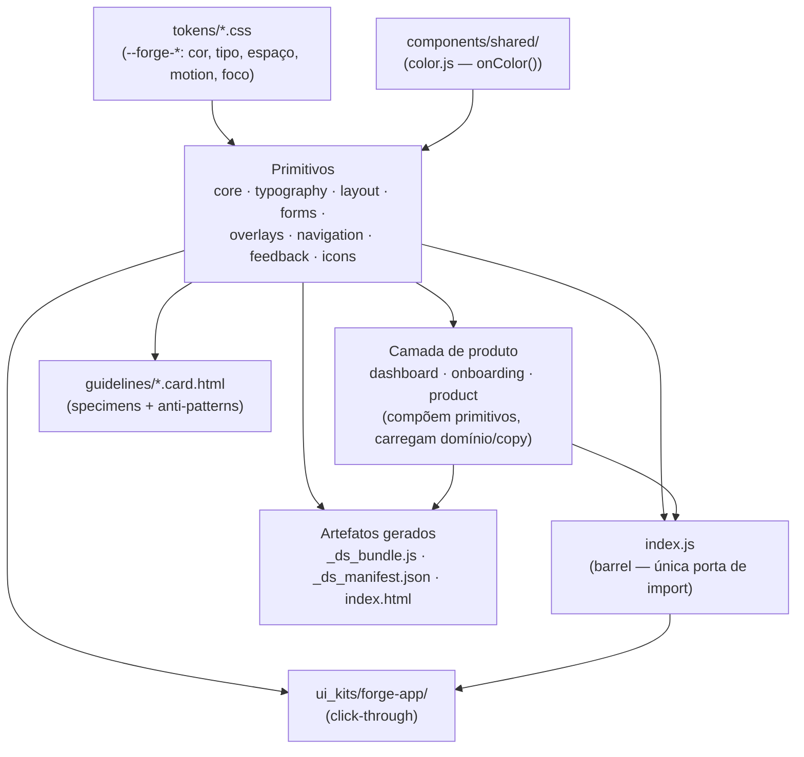

# Arquitetura — Forge DS

OP-179. Como o design system se posiciona entre o app, a documentação e a origem
histórica. A **fonte de verdade única é este repositório** (`Forge-App-Dev/forge-ds`);
o Claude Design foi descontinuado como origem em 2026-07-13 (ver `FLUXO_EVOLUCAO_DS.md`).

## Fluxo de origem e consumo

- **Claude Design → forge-ds:** só o export inicial (1.0.0). Relação encerrada.
- **forge-app ↔ forge-ds:** o DS é **espelho** dos primitivos do app hoje. O check-drift
  (OP-014) usa os `sourceHash` do bundle para detectar divergência. Direção futura
  (OP §11.2): inverter parcialmente — tokens/specs do DS viram fonte consumida pelo app.
- **forge-ds → Pages:** cada push publica; Mateus revisa renderizado.
- **forge-ds ↔ forge-docs:** a auditoria mora em forge-docs e pauta o `ROADMAP_DS.md`.

## Arquitetura interna do repo

### Regras estruturais
- **Fundação antes de superfície:** tokens existem antes do componente que os consome
  (FLUXO §4).
- **Primitivos são domain-free e white-label-safe.** A camada de produto (`product/`,
  e por posicionamento `dashboard/`/`onboarding/`) **compõe** primitivos e carrega copy —
  nunca o contrário.
- **Import só pelo barrel `index.js`** — o lint (`_adherence`) proíbe importar internals
  de componente. Ver `docs/DS_ARTIFACTS.md`.
- **Aderência forçada:** hex/px crus e fontes fora de Barlow/Inter são bloqueados; props
  fora do contrato de cada componente são bloqueadas.

## Camadas (do mais estável ao mais volátil)
`tokens` → `shared` → `primitivos` → `produto` → `ui_kit` / `guidelines`.
Mudança sobe: tocar um token pode afetar tudo acima (por isso token é a camada mais
protegida pelo versionamento, ADR-0071).
